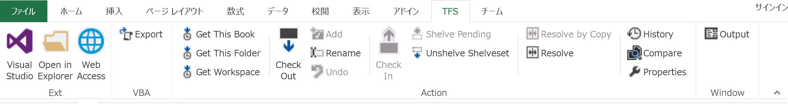
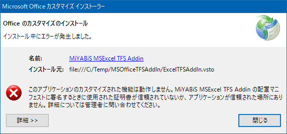
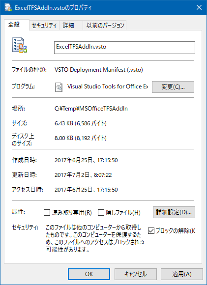
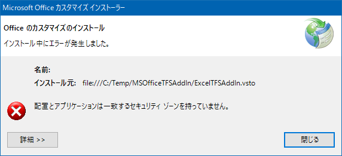
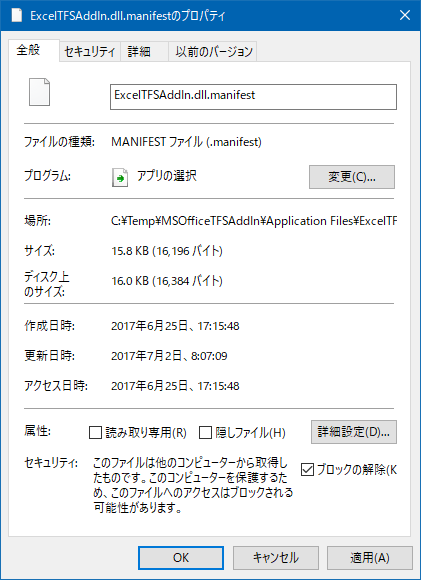
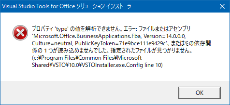
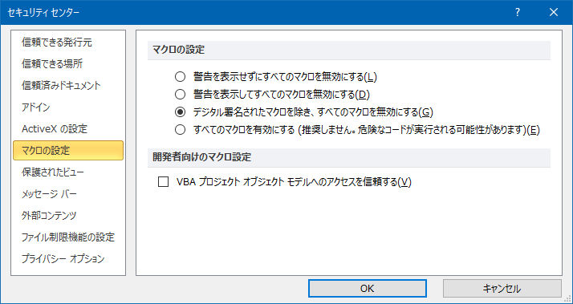

# MS Office TFS Addin

Excel や Word 等の Office 系文書を TFS でソース管理している場合、修正した際にチェックインするためだけに Visual Studio を起動しないといけないのは不便です。このアドインを使うとリボンに TFS タブが追加され、Visual Studio を起動しなくてもチェックイン等の TFS バージョン操作コマンドが実行できます。内部的には [TFS のバージョン管理コマンドラインツールの TF.exe](https://msdn.microsoft.com/ja-jp/library/cc31bk2e(v=vs.120).aspx) を操作しています。
ついでに VBA のコードもソース管理するために、エクスポート機能もつけました。
「コピーして競合を解決」メニューは、[TortoiseSVN](https://tortoisesvn.net/) または [TortoiseGit](https://tortoisegit.org/) が既にインストールされている場合、Excel、WordはTortoiseSVNまたはTortoiseGitを使用して比較できます。

## TFS リボンタブメニュー

* 外部
  * Visual Studio
  * エクスプローラで開く
  * Web Access
* VBA
  * エクスポート
* 操作
  * 最新を取得(ブック)
  * 最新を取得(フォルダ)
  * 最新を取得(ワークスペース)
  * チェックアウト
  * 追加
  * 名前の変更
  * 元に戻す
  * チェックイン
  * 棚上げ (シェルブ)
  * 棚上げを復元 (アンシェルブ)
  * コピーして競合を解決
  * 競合の解決
  * 履歴
  * 比較
  * プロパティ
* ウィンドウ
  * 出力

開いた文書ファイルが TFS 管理下（ワークスペース内）であれば全てのメニューが表示されます。

管理下でないときは、TFS操作以外のメニューのみが表示されます。

## 必要な環境

.Net Framework 4.5.2

## 動作する Office アプリケーション

* Excel : 2013, 2010
* Word : 2013, 2010 
* PowerPoint : 2013, 2010
* Project : 2013, 2010
* Visio : 2013, 2010

## 動作する TF.exe 

* Visual Studio : 2015, 2013, 2012, 2010
* Team Explorer : 2015, 2013, 2012, 2010

## 言語

* English

  

* Japanese

  

## ライセンス

Microsoft Public License (MS-PL)

http://opensource.org/licenses/MS-PL

## インストールと設定

ダウンロードした圧縮ファイルを適当なフォルダへ解凍し、各種VSTOファイルを実行してください。
セットアップファイルをインストールした場合は「C:\Program Files (x86)\MiYABiS\MSOfficeTFSAddin」フォルダ配下の各種VSTOファイルを実行してください。

* インストール時に下記のエラーが発生するとき

  

  VSTOファイルのプロパティを開きブロックの解除ボタンをクリックしてプロパティ画面を閉じます。

  

* この状態でインストールし下記のエラーが発生するとき

  

  各Addinのmanifestファイルのプロパティを開き同様にブロックの解除を行ってから再度インストールします。

  

* この状態でインストールし下記のエラーが発生するとき

  

  エラーメッセージに表示されている「VSTOInstaller.exe.config」ファイルを「VSTOInstaller.exe.config.bak」等にリネームします。

## Office のマクロの設定

  

## バージョンアップ

バージョンアップするときは、前回と同じフォルダへ解凍してください。
VSTOファイルは実行しなくてもExcelやWordを実行すると自動でバージョンアップされます。

