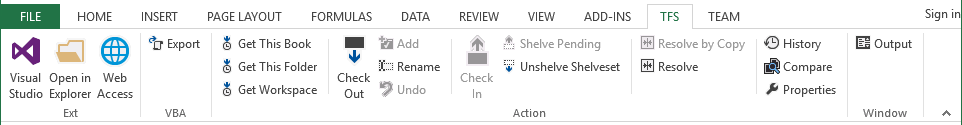
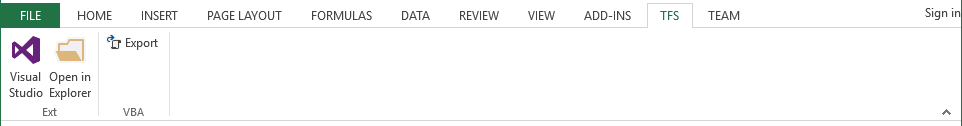
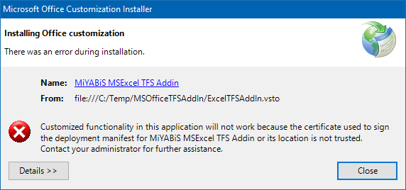
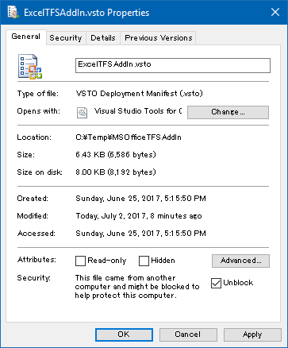
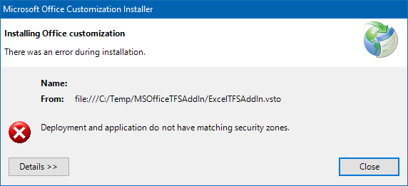
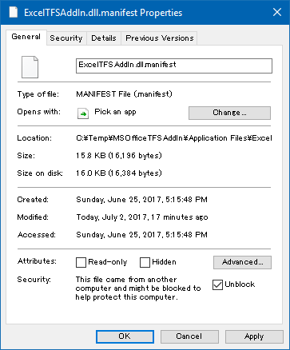
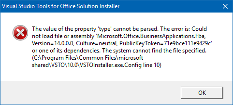

# MS Office TFS Addin

Microsoft Office (Excel, Word, PowerPoint, Project, Visio) add-ins that assist document version control.
You can invoke TF.exe ([TFS version control command line tool TF.exe](https://msdn.microsoft.com/en-US/library/cc31bk2e(v=vs.120).aspx)) commands from tool bar or ribbon interface of Microsoft Office.
In addition, we have also added the function to export VBA code.
The "Copy and resolve conflict" menu can be compared using Excel, Word using [TortoiseSVN](https://tortoisesvn.net/) or [TortoiseGit](https://tortoisegit.org/) if TortoiseSVN or TortoiseGit is already installed.

日本語のドキュメントは [こちら](README.ja.md)。

## TFS Ribbon Tab Menu

* Ext
  * Start Visual Studio
  * Open in Explorer
  * Web Access
* VBA
  * VBA Export
* Action
  * Get This Book
  * Get This Folder
  * Get Workspace
  * Check Out
  * Add
  * Rename
  * Undo
  * Check In
  * Shelve Pending
  * Unshelve Shelveset
  * Resolve by Copy
  * Resolve
  * History
  * Compare
  * Properties
* Window
  * Output

If the opened document file is TFS controlled (in the workspace), all menus are displayed.

When not under control, only menus other than TFS operation are displayed.

## For Use

.Net Framework 4.5.2

## Office Application Supports

|            | 2019 | 2016 | 2013 | 2010 |
|------------|:----:|:----:|:----:|:----:|
| Excel      | O    | O    | O    | O    | 
| Word       | O    | O    | O    | O    | 
| PowerPoint | O    | O    | O    | O    | 
| Project    | *1   | *1   | O    | O    | 
| Visio      | *1   | *1   | O    | O    |

*1 : Operation is unconfirmed

## TF.exe Supports

|               | 2019 | 2017 | 2015 | 2013 | 2012 | 2010 |
|---------------|:----:|:----:|:----:|:----:|:----:|:----:|
| Visual Studio | O    | O    | O    | O    | O    | O    |
| Team Explorer | O    | O    | O    | O    | O    | O    |

## Language Supports

* English

  

* Japanese

  

## License

Microsoft Public License (MS-PL)

http://opensource.org/licenses/MS-PL

## Install

Extract the downloaded compressed file to a suitable folder and execute various VSTO files.
When installing the setup file please execute various VSTO files under "C:\Program Files (x86)\MiYABiS\MSOfficeTFSAddin" folder.

* When the following error occurs during installation

  

  Open the property of the VSTO file and click the Unblock button or checkbox checked to close the properties screen.

  

* When installing in this state, when the following error occurs

  

  Open the property of each Addin's manifest file, unblock in the same way, and install again.

  

* When installing in this state, when the following error occurs

  

  Rename the "VSTOInstaller.exe.config" file displayed in the error message to "VSTOInstaller.exe.config.bak" etc.

## Office macro settings

  

## Version upgrade

To upgrade, please unzip to the same folder as last time.
Even if you do not run the VSTO file, it will be upgraded automatically when you run Excel or Word.
